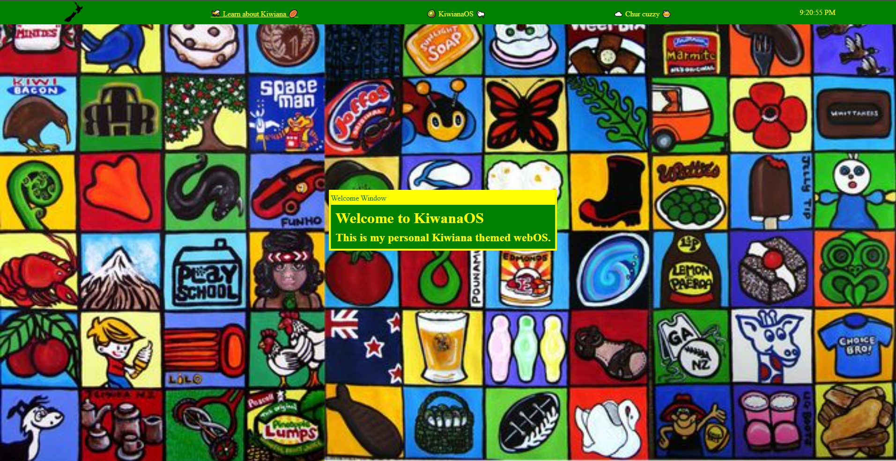

# Kiwiana WebOS
## A kiwiana themed OS that runs in the browser, made for the 2026 Stardance Challenge.

# <ins>[View the live demo](https://jdo1-des.github.io/WebOS-1/)</ins>
### Features:
- Design inspired by Kiwiana Culture :new_zealand:
- Working operating system that runs in a browser 🔎
- Open and drag multiple windows 
- Custom-built apps 
- References  to classic Kiwi moments and culture :kiwi_fruit:
### How it works
I built it using HTML, CSS, and JavaScript. This gives them good cross-platform compatibility as most web browsers support these languages. Because these languages are so popular it means there is a wide variety of libraries and tools out there I can use. However, while most browsers support HTML, CSS, and JavaScript they can have inconsistent behaviour, which causes subtle differences in the WebOS.
### Credits/Acknowledgements
- SerenityUX for the guide
- W3schools for additional help with the HTML and CSS
- Anyone who tries my WebOS
